# uni-pushy-server

## 📌 简介

`uni-pushy` uni-app 热更新管理平台。简称 `upushy`.

这是 `uni-pushy` 的后端仓库。Github：[uni-pushy-server](https://github.com/SunSeekerX/uni-pushy-server)

基于 `nestjs` +`typeorm`+`redis`+`mysql`+`jsonwebtoken`+`class-validator`+`restful`。

**配套客户端 SDK**：**[ uni-pushy-client](https://github.com/SunSeekerX/uni-pushy-client)**

**配套管理面板**：**[uni-pushy-admin](https://github.com/SunSeekerX/uni-pushy-admin)**

**预览地址**：**[https://uni-pushy.yoouu.cn/](https://uni-pushy.yoouu.cn/)**

> 自行注册账号使用即可体验，对项目部署不熟悉的同学可以先使用我部署的服务做为测试。
>
> 只需要简单的配置下客户端就行。

**预览接口文档**：[https://api.uni-pushy.yoouu.cn/docs/](https://api.uni-pushy.yoouu.cn/docs/)

> **uni-app App 整包升级检测：** https://ask.dcloud.net.cn/article/34972
>
> **uni-app App 资源热更新：** https://ask.dcloud.net.cn/article/35667

## 📌 快速上手

### Docker 部署

**拉取镜像**

```shell
# 带面板
docker pull sunseekerx/upushy:latest
# 不带面板
docker pull sunseekerx/upushy-server:latest
```

**新建一个数据库**

**新建配置文件 `/etc/upushy/env.production.yaml`**

```shell
mkdir -p /etc/upushy/
cd /etc/upushy/
vim env.production.yaml
```

**配置文件参考**

`/etc/upushy/env.production.yaml` 字段说明查看 [全部环境变量](###全部环境变量)

```yaml
WEB_OSS: false

ALIYUN_OSS_ENDPOINT: 'oss-cn-xxxxxx'
ALIYUN_OSS_BUCKET: 'uni-pushy'

ALIYUN_ACCOUNT_ID: 'xxxxxxxxxxxx'
ALIYUN_ACCOUNT_RAM_ROLE: 'xxxxxx'
ALIYUN_RAM_ACCESS_KEY_ID: 'xxxxxx'
ALIYUN_RAM_ACCESS_KEY_SECRET: 'xxxxxx'

DB_HOST: '0.0.0.0'
DB_PORT: 3306
DB_USER: 'user'
DB_PASSWORD: 'password'
DB_DATABASE: 'upushy'

REDIS_HOST: '0.0.0.0'
REDIS_PORT: 6379
REDIS_DB: 1
REDIS_PASSWORD: 'password'
```

**启动容器**

默认端口为 `3000`，如果你通过配置文件改变了端口号，需要映射为你更新过后的端口。

```shell
# 带面板
docker run -d -p 3000:3000 --name=upushy -v /etc/upushy/env.production.yaml:/app/env.production.yaml --restart=always sunseekerx/upushy
# 仅服务
docker run -d -p 3000:3000 --name=upushy-server -v /etc/upushy/env.production.yaml:/app/env.production.yaml --restart=always sunseekerx/upushy-server
```

> 如果无法同步数据库表格，请配置不自动同步数据库表格 `DB_TABLE_SYNC`，到项目根目录下找到 `sql` 文件夹下最新的 `sql` 脚本手动执行一遍。然后在启动容器

### Pm2 部署

[pm2 官网](https://pm2.keymetrics.io/docs/usage/quick-start/)

**克隆项目**

**全局安装 pm2**

```bash
npm install pm2@latest -g
# or
yarn global add pm2
```

**安装运行依赖**

```shell
npm install --production
# or
yarn --prod
```

**新建配置文件 `uni-pushy-server/env.production.yaml`**

需要填写的项查看 [Docker 部署](###Docker 部署)

**编译项目**

```bash
npm run build
# or
yarn build
```

**启动项目**

```bash
pm2 start ecosystem.config.js --env production
```

### 开发

**克隆仓库**

```bash
git clone https://github.com/SunSeekerX/uni-pushy-server.git
```

**进入项目目录**

```bash
cd uni-pushy-server/
```

**安装依赖**

```bash
npm i
# or
yarn
```

> 国内网络安装过慢可以安装 `tbify`， 使用说明：[tbify](https://doc.yoouu.cn/front-end/npm/#%F0%9F%93%8C-%E5%8A%A0%E9%80%9F%E4%B8%8B%E8%BD%BD-tbify)

**配置环境变量，根目录下执行**

```bash
mv env.development.yaml env.development.yaml
```

**打开 `env.development.yaml`，填写相关环境变量，参考 Docker 部署**

**启动**

```bash
npm run serve
# or
yarn serve
```

### Docker 构建

本地构建带管理面板的镜像需要拉取管理面板编译导出的资源放到 `uni-pushy-server/client` 下！管理面板编译环境变量参考

`uni-pushy-admin/.env.production`

```shell
# 运行模式
NODE_ENV=production

#
VUE_APP_PREVIEW=true

# 请求超时时间 default：6000
VUE_APP_REQUEST_TIMEOUT=6000

# 请求地址前缀，不带“/”！
VUE_APP_API_BASE_URL=/

VUE_APP_API_RSA_PUBLIC_KEY='-----BEGIN PUBLIC KEY-----xxxxxxxxxxx-----END PUBLIC KEY-----'

VUE_APP_WEB_OSS=false
VUE_APP_ALIYUN_OSS_REGION=
VUE_APP_ALIYUN_OSS_BUCKET=
VUE_APP_ALIYUN_ACCESS_KEY_ID=
VUE_APP_ALIYUN_ACCESS_KEY_SECRET=
```

**构建镜像**

```shell
# 包含管理面板
docker build -t upushy .
# 仅服务
docker build -f Dockerfile.server -t upushy-server .
```

**启动容器**

```shell
# 带面板
docker run -d -p 3000:3000 --name=upushy -v /w/code/nodejs/env.production.yaml:/app/env.production.yaml --restart=always upushy
# 仅服务
docker run -d -p 3000:3000 --name=upushy-server -v /w/code/nodejs/env.production.yaml:/app/env.production.yaml --restart=always upushy-server
```

**推送镜像**

```shell
# 打 tag
docker tag upushy sunseekerx/upushy:latest
# 推送带面板
docker push sunseekerx/upushy:latest

# 打 tag
docker tag upushy-server sunseekerx/upushy-server:latest
# 推送仅服务
docker push sunseekerx/upushy-server:latest
```

## 📌 环境变量相关说明

### 全部环境变量

```yaml
# 服务端口 默认：3000 1-65535
SERVER_PORT: 3000
# 是否打开文档 默认：true
PRO_DOC: true
# 是否直接通过前端访问 oss
WEB_OSS: false
# Token 生成加盐 默认：'secret-key'
TOKEN_SECRET: 'secret-key'
# Api 加密 RSA 私钥 默认：请查看源码
API_SIGN_RSA_PRIVATE_KEY: ''
# Api 加密请求过期间隔，超出即被认为为过期请求 默认：15 单位：s
API_SIGN_TIME_OUT: 15
# 是否自动同步数据库表格
DB_TABLE_SYNC: true

# OSS 入口
ALIYUN_OSS_ENDPOINT: 'oss-cn-xxxxxx'
# OSS 存储桶名
ALIYUN_OSS_BUCKET: 'uni-pushy'

# 阿里云账号相关，如果 WEB_OSS 为 true 可以不填写，具体获取方式在下方
ALIYUN_ACCOUNT_ID: 'xxxxxxxxxxxx'
ALIYUN_ACCOUNT_RAM_ROLE: 'xxxxxx'
ALIYUN_RAM_ACCESS_KEY_ID: 'xxxxxx'
ALIYUN_RAM_ACCESS_KEY_SECRET: 'xxxxxx'
# 阿里云 sts 临时账户有效期 默认：15 单位：min 最低：15min
ALIYUN_RAM_TEMPORARY_EXPIRE: 15

# 数据库 host
DB_HOST: '0.0.0.0'
# 数据库端口
DB_PORT: 3306
# 数据库用户
DB_USER: 'user'
# 数据库密码
DB_PASSWORD: 'password'
# 数据库名
DB_DATABASE: 'upushy'

# Redis host
REDIS_HOST: '0.0.0.0'
# Redis 端口
REDIS_PORT: 6379
# Redis 库
REDIS_DB: 1
# Redis 密码
REDIS_PASSWORD: 'password'
# Redis prefix
REDIS_PREFIX: ''
```

### WEB_OSS

用来标识是否直接通过前端访问 oss，如果设置为 `true`，以下环境变量可以不填写,相关环境变量填写到前端。

- `ALIYUN_ACCOUNT_ID`
- `ALIYUN_ACCOUNT_RAM_ROLE`
- `ALIYUN_RAM_ACCESS_KEY_ID`
- `ALIYUN_RAM_ACCESS_KEY_SECRET`
- `ALIYUN_RAM_TEMPORARY_EXPIRE`

### 阿里云环境变量解释

> 在后台主要用户生成临时凭证给前端直接上传文件到 `oss`,这种方式有众多优点
>
> - 支持分片上传
> - 支持大文件上传
> - 上传带宽取决于客户端的带宽
> - 临时凭证保证访问安全
> - ...
>
> [授权访问文档](https://help.aliyun.com/document_detail/32077.htm)

#### ALIYUN_ACCOUNT_ID

阿里云账号 id，登陆阿里云右上角鼠标悬浮在头像即可显示。

<details>
  <summary>展开/收起</summary>
  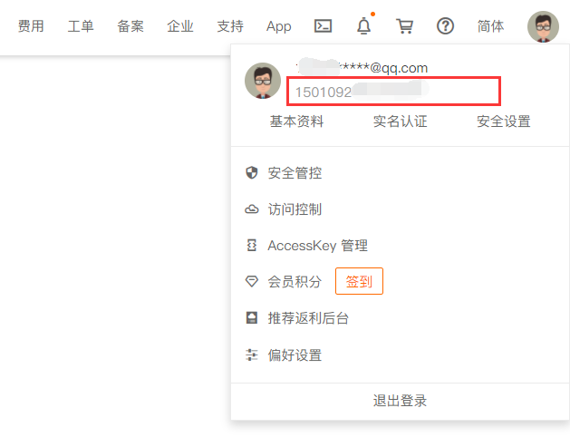
</details>

#### ALIYUN_ACCOUNT_RAM_ROLE

阿里云资源访问角色，该角色主要用于访问 oss 服务。必须具有 `AliyunOSSFullAccess` 权限。

1. 鼠标悬浮右上角>访问控制

   <details>
     <summary>展开/收起</summary>
     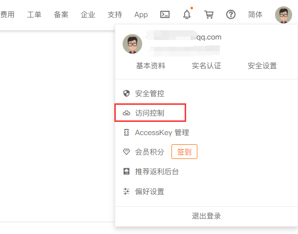
   </details>

2. <details>
     <summary>展开/收起</summary>
     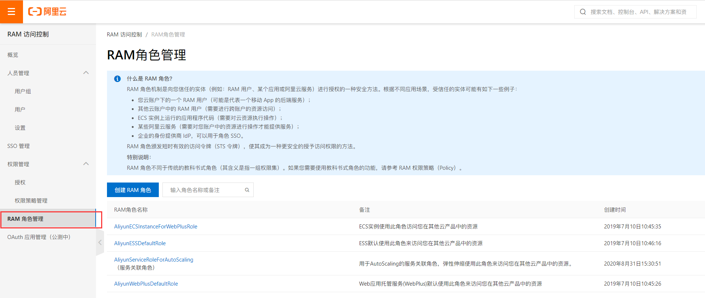
   </details>

3. 创建一个角色，默认系统没有访问 oss 服务的角色。选择阿里云账号

   <details>
     <summary>展开/收起</summary>
     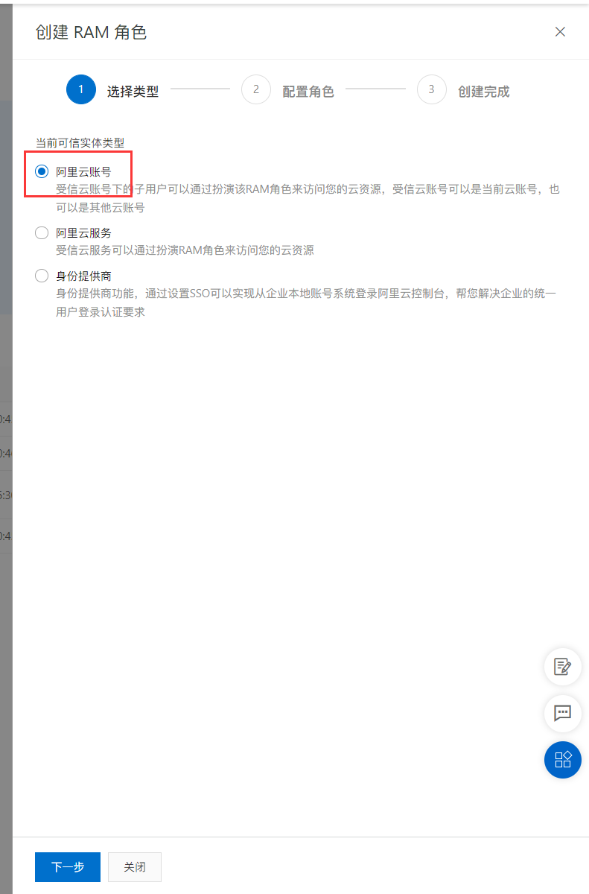
   </details>

4. 填写角色名称

   <details>
     <summary>展开/收起</summary>
     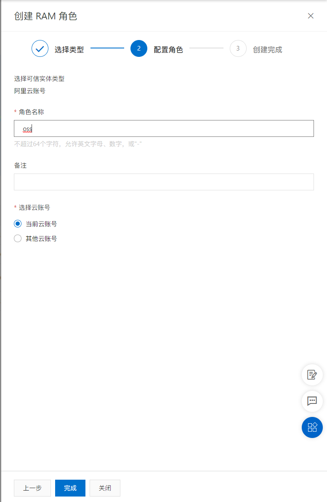
   </details>

5. 分配角色权限

   <details>
     <summary>展开/收起</summary>
     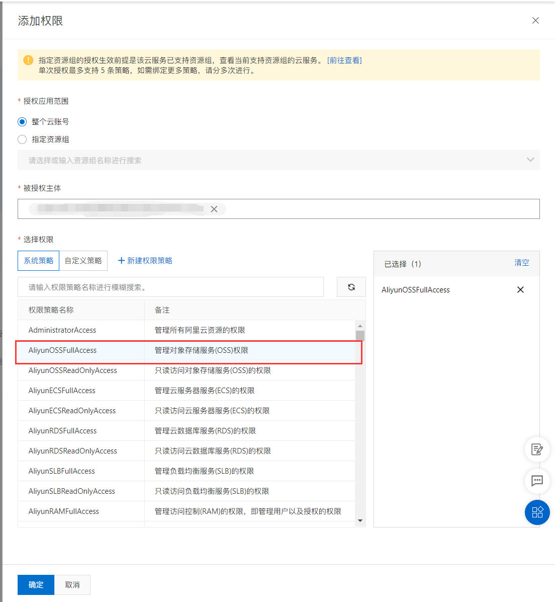
   </details>

#### ALIYUN_RAM_ACCESS_KEY_ID

ram 用户访问 id，该用户必须具有 `AliyunSTSAssumeRoleAccess` 权限

1. 创建一个用于生成临时凭证的用户，创建完成就能拿到 `ALIYUN_RAM_ACCESS_KEY_ID` 和 `ALIYUN_RAM_ACCESS_KEY_SECRET`

   <details>
     <summary>展开/收起</summary>
     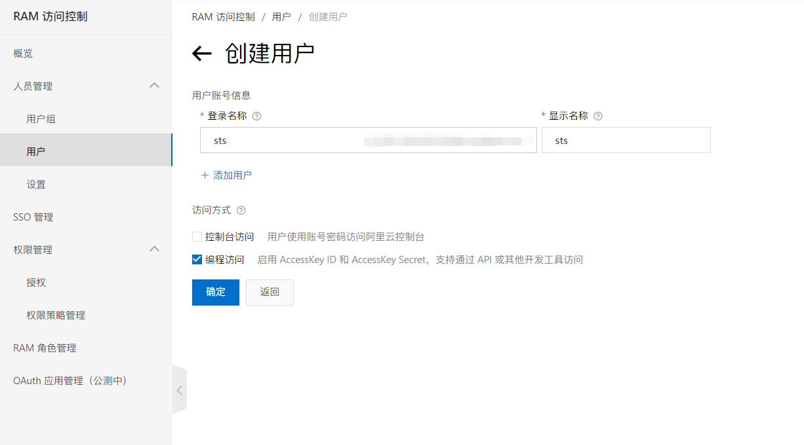
   </details>

2. 给刚刚创建的用户分配权限

   <details>
     <summary>展开/收起</summary>
     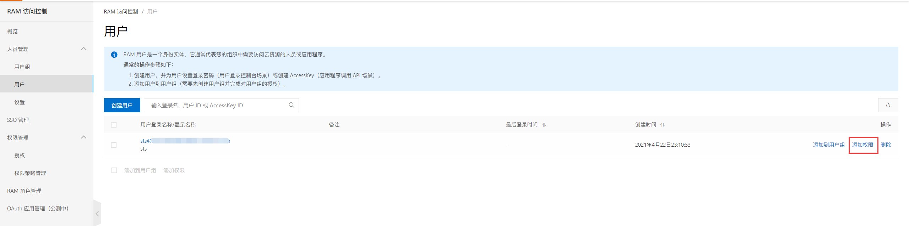
   </details>

3. 分配 `AliyunSTSAssumeRoleAccess` 权限

   <details>
     <summary>展开/收起</summary>
     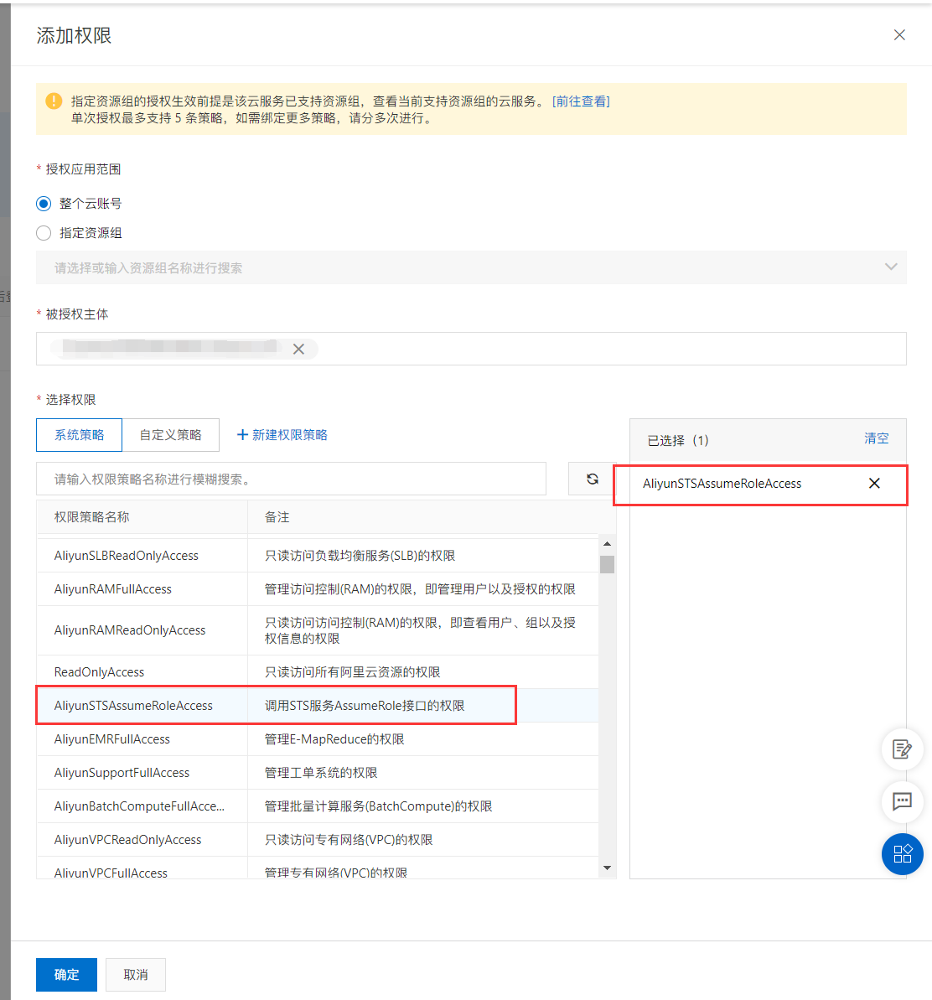
   </details>

#### ALIYUN_RAM_ACCESS_KEY_SECRET

同 [`ALIYUN_RAM_ACCESS_KEY_ID`](####ALIYUN_RAM_ACCESS_KEY_ID)

### oss 存储桶配置

1. 新建 oss 存储桶

   <details>
     <summary>展开/收起</summary>
     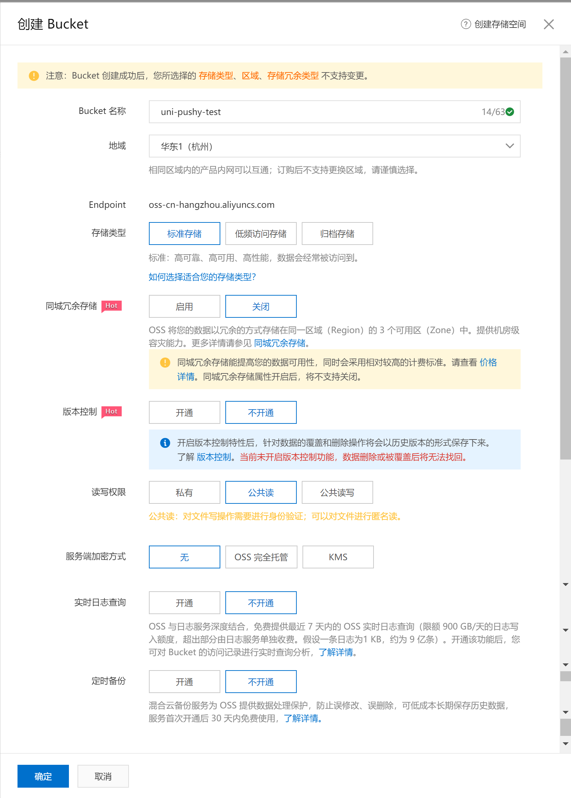
   </details>

2. 跨域设置

   <details>
     <summary>展开/收起</summary>
     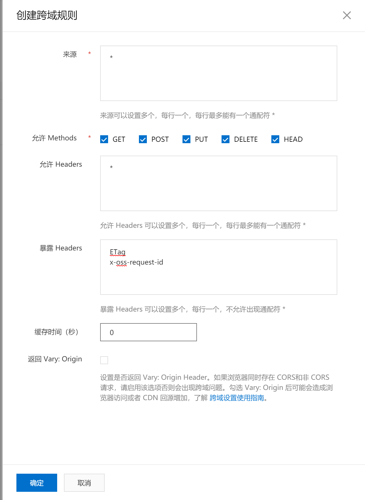
   </details>

   > ETag x-oss-request-id

## 📌 更新日志

[CHANGELOG](./CHANGELOG.md)

## 📌 uni-app 接入

请查看 **[ uni-pushy-client](https://github.com/SunSeekerX/uni-pushy-client)** 说明。

## 📌 自建后台

有一部分同学需要我的后台设计思路，想集成到自己的后台。事实上现在的热更新后台功能确实不是很强大。这里提供一下后台开发的一些思路和怎么构建一个后台和 `uni-pushy-client` 进行配合工作。

### 检查更新接口

`uni-pushy-client` 只需要一个接口就可以进行工作了。[update](https://api.uni-pushy.yoouu.cn/docs/#/Basic/AppController_update)，也就是这个接口。看下请求参数和返回信息

**入参**

```javascript
{
  // 项目id，标识项目
  "projectId": "866116d35b382bb6e1ae0cbb484b9950",
  // 平台
  "platform": "android",
  // 热更新资源版本
  "wgtVersion": "1.0.0",
  // 热更新资源版本号
  "wgtVersionCode": 100,
  // 原生资源版本
  "nativeVersion": "1.0.0",
  // 原生资源版本号
  "nativeVersionCode": 100
}
```

**返回**

```json
{
  "success": true,
  "statusCode": 200,
  "message": "成功",
  "data": {
    "wgt": {
      "id": "392029975c32603c4480e4a3edbe5f7c",
      "projectId": "866116d35b382bb6e1ae0cbb484b9950",
      "version": "1.1.25",
      "versionCode": 1125,
      "nativeVersionCode": 1119,
      "url": "https://uni-pushy.oss-cn-hangzhou.aliyuncs.com/2021-02/2021-02-28 16:46:64.1614502019649.__UNI__B843CC0.wgt",
      "updateType": 1,
      "type": 1,
      "status": 1,
      "changelog": "1.1.25\nbuild:1125\n2021-02-28 16:46:47",
      "remark": "",
      "createdTime": "2021-02-28T08:46:59.793Z",
      "updatedTime": "2021-02-28T08:46:59.793Z"
    },
    "native": {
      "id": "1e0820e3ac9e15af1667dc57251c64ab",
      "projectId": "866116d35b382bb6e1ae0cbb484b9950",
      "version": "1.1.19",
      "versionCode": 1119,
      "nativeVersionCode": 0,
      "url": "https://uni-pushy.oss-cn-hangzhou.aliyuncs.com/2021-2-7/1612709287834.__UNI__B843CC0_0207224602.apk",
      "updateType": 1,
      "type": 3,
      "status": 1,
      "changelog": "一曲新词酒一杯，去年天气旧亭台。夕阳西下几时回？\n无可奈何花落去，似曾相识燕归来。小园香径独徘徊。\n\n1.1.19\nbuild:1119\n2021-02-07 22:49:21",
      "remark": "",
      "createdTime": "2021-02-07T14:49:25.538Z",
      "updatedTime": "2021-02-07T14:49:25.538Z"
    }
  }
}
```

所有的更新逻辑都是通过 `uni-pushy-client` 完成的。后台只提供了最新的版本号。和下载地址。

### 资源分类

更新分为原生资源和 `wgt` 热更新资源。资源有分为 `android` 和 `ios` 两个平台。后台其他的功能是对这些资源的管理。

`updateType`

更新类型（1：用户同意更新，2：强制更新，3：静默更新）

`type`

资源类型（1：wgt-android 2：wgt-ios 3：android，4：ios）

`status`

资源状态（0：禁用 1：启用）

## 📌 TODO

- 检查更新结果缓存
- 接口限流
- 文章：`Nodejs` `rsa` 加密的使用

## 📌 FAQ

### 这是什么？

一个 `uni－app` 热更新的管理后台。

### 有什么用？

可以用来管理 `uni-app` 热更新的资源和版本。

### 什么是热更新？

装在手机上的 app，不让用户知道就可以增加删除某些功能。快速修复 bug，快速更新功能。

### 有哪些技术用到了热更新？

`React native` ，`flutter `，`uni-app`

### 为什么要做这个？

网上又没有，不只能自己做。

### 后端用的是什么语言框架？

[NestJs](https://nestjs.com/)

### 为什么用 Nestjs ？

巨好用啊啊啊~

### 为什么要用 antd-vue？

`element-ui` 有一段时间不维护了，搞得人心惶惶，现在又有了，不知道啥意思。

~~至少它一直在更新，你来维护 `element-ui` 吗？~~

### TS 怎么样？

有一次写 `vue` 尝试了下 `ts`，感觉像 "si" 一样。写 `ts` 还要多些那么多代码，为什么还要确定数据类型，有什么 `interface` ，`type`。

无意中看到了 `nestjs `，写多了 `ts ` 感觉 `js` 像 "si" 一样。

### Nestjs 好用吗？

`Node` 后端要是火起来，`nestjs` 应该是碾压 `express`，`koa2`，`egg.js`。。。

### 为什么要用你写的？

你不想看看我是怎么实现的吗？

### 会持续更新吗？

不会

### 确实学到了一些东西怎么感谢你？

啊这~，你给我点一个 ⭐ 嘛～

### 有问题可以问你吗？

你要是知道你的问题是什么，可以来问我。

### 怎么联系你。

能找到这个项目找不到我的联系方式？
